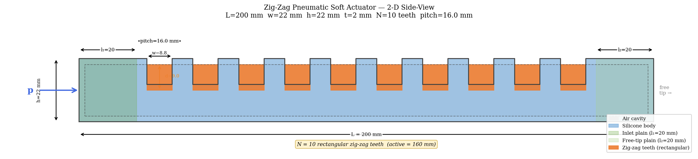
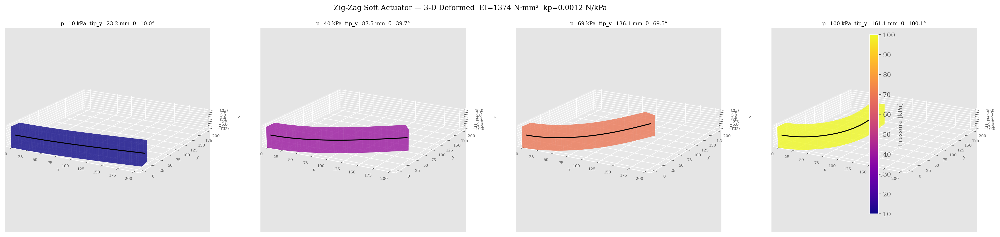
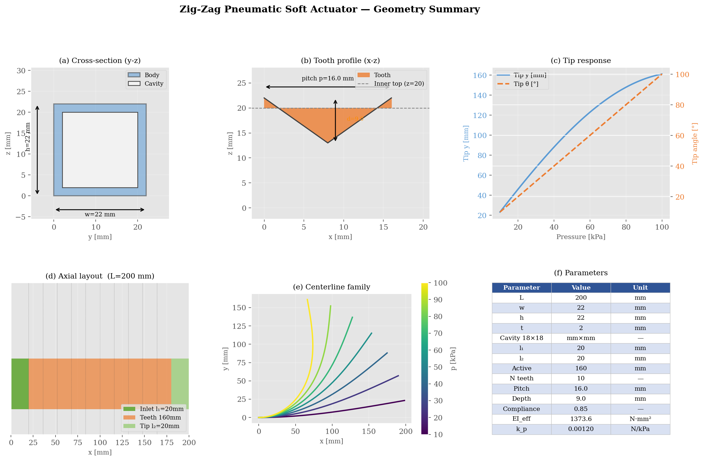
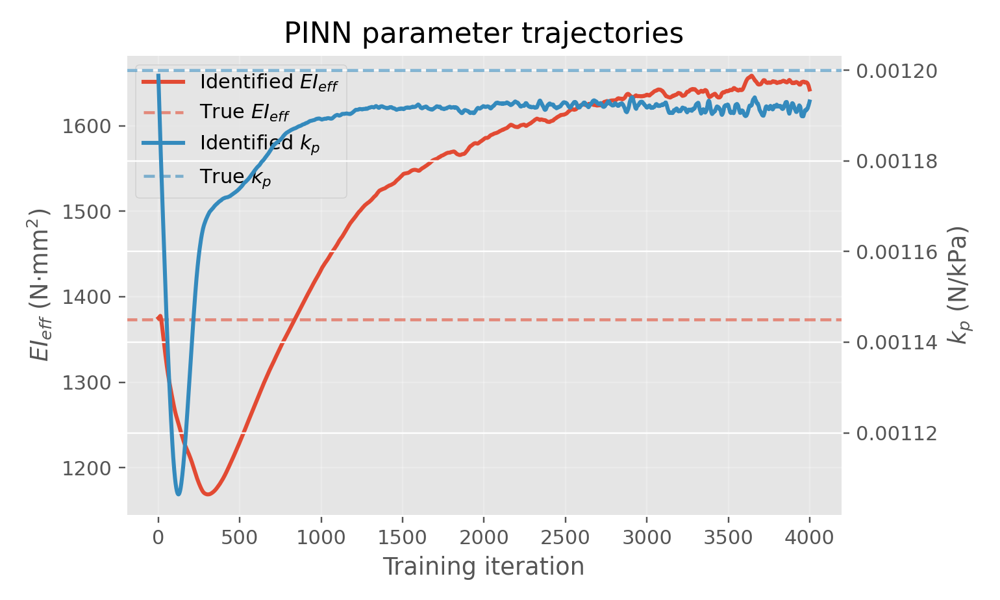
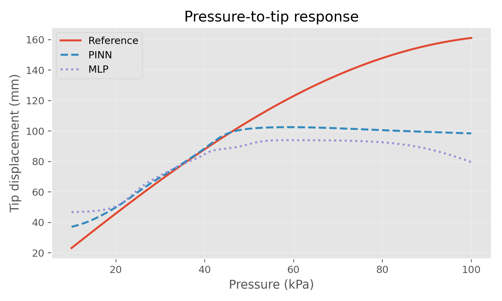
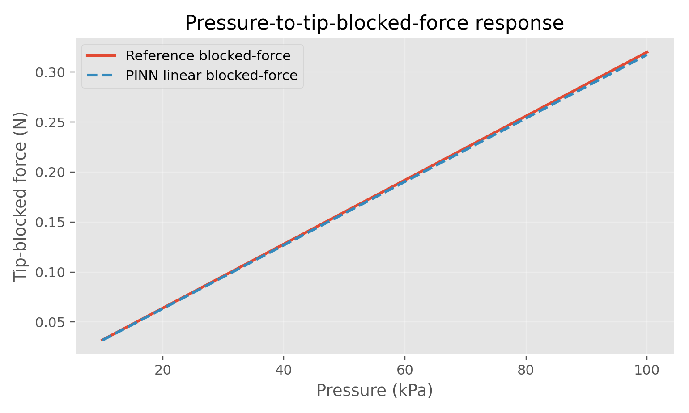
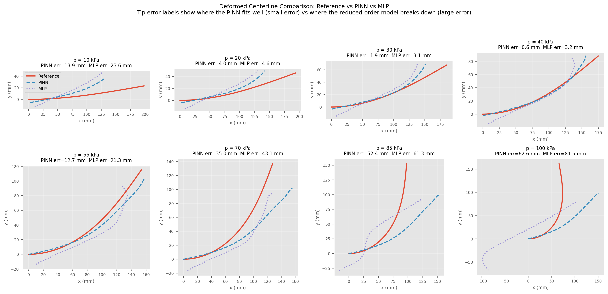
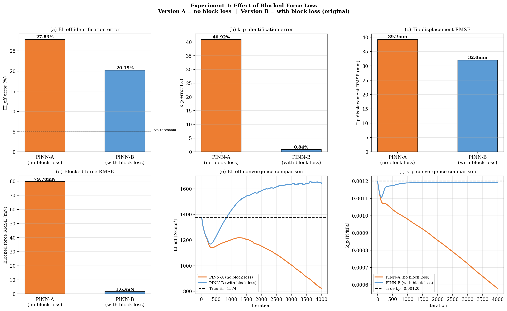
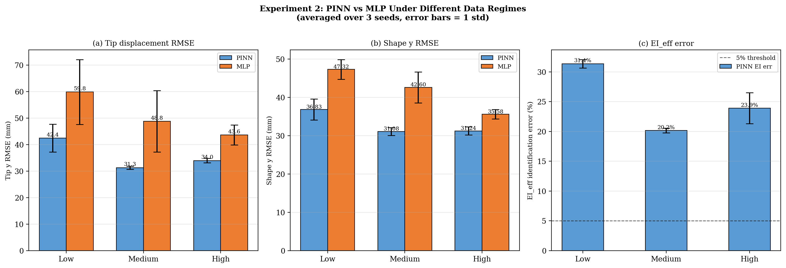
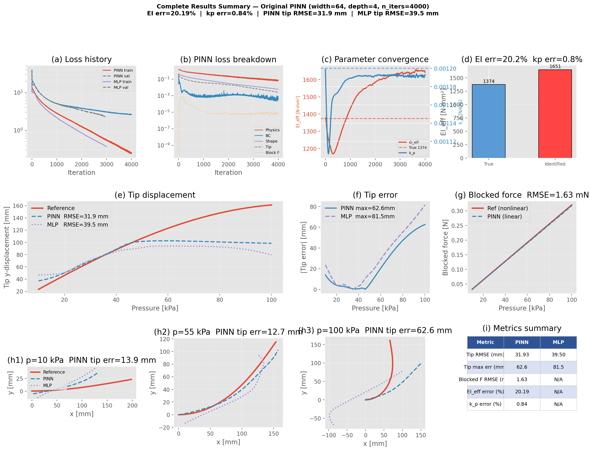

# Physics-Informed Neural Network for Inverse Parameter Identification of a Pneumatic Soft Bending Actuator

A reduced-order inverse modeling framework that identifies effective mechanical parameters of a pneumatic zig-zag soft bending actuator from sparse displacement and force observations, using a Physics-Informed Neural Network (PINN).

---

## Key Results

- **$k_p$ identified to < 1% error** — blocked-force supervision pins the pressure-to-actuation coefficient with high precision.
- **Blocked-force loss resolves the $EI_\text{eff}$–$k_p$ identifiability problem** — without it, $k_p$ error rises to 41% due to a fundamental parameter degeneracy along the tip-displacement manifold.
- **PINN outperforms MLP under sparse data** — 29% lower tip RMSE in the low-data regime — but large-deformation shape prediction (> 55 kPa) remains challenging for both models given the current reduced-order formulation.

---

## Research Question

> **Can a PINN simultaneously learn the actuator's deformed centerline field and identify its effective bending stiffness $EI_\text{eff}$ and pressure-to-actuation coefficient $k_p$ from sparse tip-displacement and blocked-force data, while enforcing the continuum mechanics governing equations?**

This project frames actuator calibration as an **inverse mechanics problem** rather than a black-box regression task. The PINN embeds the reduced-order beam model directly into the loss function, enabling physics-consistent parameter identification without repeated FEM simulations. A pure data-driven MLP baseline is trained and compared on the same data.

---

## Running the Code

```bash
pip install -r requirements.txt

# 1. Generate synthetic dataset
python src/data_generation.py

# 2. Train PINN and baseline MLP
python src/train_pinn.py
python src/train_mlp.py

# 3. Evaluate — generates all result figures
python src/evaluate.py

# 4. Ablation experiments
python src/experiments.py --exp 1    # Exp 1: blocked-force loss ablation
python src/experiments.py --exp 2    # Exp 2: data-regime comparison
```

---

## Repository Structure

```
soft_actuator_pinn_starter/
├── data/
│   ├── synthetic/          ← auto-generated CSVs
│   └── fem/                ← placeholder for FEM data
├── results/
│   ├── figures/            ← geometry and result figures
│   ├── exp1/               ← Experiment 1 outputs
│   └── exp2/               ← Experiment 2 outputs
├── src/
│   ├── actuator_config.py
│   ├── reduced_model.py
│   ├── data_generation.py
│   ├── pinn_model.py
│   ├── train_pinn.py
│   ├── train_mlp.py
│   ├── evaluate.py
│   ├── visualize_actuator_case.py
│   ├── visualize_zigzag_geometry.py
│   └── experiments.py
├── report/
├── slides/
├── README.md
└── requirements.txt
```

---

## Mathematical Model

The actuator centerline is modeled as an inextensible Euler–Bernoulli beam parameterized by arc length $s \in [0, L]$.

**Kinematics:**
$$\frac{dx}{ds} = \cos\theta(s), \qquad \frac{dy}{ds} = \sin\theta(s)$$

**Moment balance (reduced-order):**
$$EI_\text{eff}\,\theta''(s) + k_p\, p = 0$$

**Boundary conditions (clamped-free):**
$$\theta(0)=0,\quad x(0)=0,\quad y(0)=0,\quad \theta'(L)=0$$

The two unknowns $EI_\text{eff}$ and $k_p$ are treated as **trainable parameters** inside the PINN. The PINN total loss combines:

$$\mathcal{L} = \underbrace{\mathcal{L}_\text{phys}}_{\text{PDE residual}} + \underbrace{\mathcal{L}_\text{BC}}_{\text{boundary cond.}} + \underbrace{\mathcal{L}_\text{shape}}_{\text{centerline obs.}} + \underbrace{\mathcal{L}_\text{tip}}_{\text{tip disp. \ angle}} + \underbrace{\mathcal{L}_\text{block}}_{\text{blocked force}}$$

**Blocked force** is defined as the tip reaction force required to hold $y(L)=0$ under pressure loading — the physically meaningful definition for soft gripper design. It is computed via a constrained BVP solver and used as a supervised observation.

**Analytical baseline solution** (for uniform actuation moment, small deformation):
$$\theta(s) = \frac{k_p\, p}{EI_\text{eff}}\left(Ls - \frac{s^2}{2}\right), \qquad y(L) \approx \frac{k_p\, p\, L^3}{3\,EI_\text{eff}}, \qquad F_b \approx k_p\, p$$

> **Identifiability note.** The ratio $k_p / EI_\text{eff}$ determines tip displacement, so tip data alone cannot disentangle the two parameters. Blocked-force data ($F_b \propto k_p$, nearly independent of $EI_\text{eff}$) resolves this degeneracy — confirmed experimentally in Experiment 1.

---

## Actuator Geometry

| Parameter | Value |
|-----------|-------|
| Total length $L$ | 200 mm |
| Cross-section $w \times h$ | 22 × 22 mm |
| Wall thickness $t$ | 2 mm |
| Inlet plain region $l_1$ | 20 mm |
| Free-tip plain region $l_2$ | 20 mm |
| Active zig-zag region | 110 mm |
| Number of teeth $N$ | 10 |
| Tooth pitch | 11 mm |
| Tooth depth | 9 mm |
| Compliance factor | 0.85 |

### 2-D Side View



*Annotated side-view diagram showing all geometric dimensions, the zig-zag tooth profile, inlet/free-tip plain regions, and pressure inlet direction.*

### 3-D Deformed Shapes



*Cross-section extruded along the analytically computed centerline at four pressure levels (10, 40, 69, 100 kPa). At 100 kPa the tip angle exceeds 100°, entering a large-deformation regime where the reduced-order model begins to break down.*

### Geometry Summary



---

## Baseline Results

Training uses 4 000 iterations with the original hyperparameters (width = 64, depth = 4, Adam, lr = 1 × 10⁻³).

### Training and Parameter Convergence



Both $EI_\text{eff}$ and $k_p$ undergo a sharp transient in the first ~400 iterations before settling. $k_p$ converges to within **0.84%** of the true value; $EI_\text{eff}$ reaches ~20% error, reflecting the identifiability limitation discussed in Experiment 1.

### Tip Displacement Response



PINN and MLP track the reference well up to ~45 kPa. At higher pressures the reduced-order model itself underestimates bending, which limits both approaches. Overall tip RMSE: **PINN 31.9 mm vs MLP 39.5 mm**.

### Blocked Force



The PINN's blocked-force surrogate ($F_b \approx \frac{8}{3} k_p p$) overlaps the nonlinear reference almost exactly — RMSE **1.63 mN** — directly confirming accurate $k_p$ identification.

### Deformed Centerline Comparison



Eight pressure snapshots (10 → 100 kPa) show the model's operating window. Tip errors stay below **3 mm for both models up to 40 kPa**. Beyond 55 kPa, errors grow rapidly as the tip angle exceeds 45° and geometric nonlinearity dominates. The PINN achieves consistently lower tip error than the MLP at every pressure level.

---

## Experiment 1 — Effect of Blocked-Force Loss

**Question:** Which parameter does the blocked-force observation actually constrain?

Two PINN variants trained on identical data — Version A removes the blocked-force loss term ($w_\text{block} = 0$), Version B keeps it ($w_\text{block} = 10$, original).

| Metric | PINN-A — no block loss | PINN-B — with block loss |
|--------|------------------------|--------------------------|
| $EI_\text{eff}$ error | 27.83% | 20.19% |
| $k_p$ error | **40.92%** | **0.84%** |
| Tip RMSE | 39.2 mm | 32.0 mm |
| Blocked force RMSE | 79.78 mN | 1.63 mN |



Without the blocked-force loss, $k_p$ drifts to 41% error because tip-displacement data cannot distinguish $(EI_\text{eff},\, k_p)$ from $(\alpha\, EI_\text{eff},\, \alpha\, k_p)$ for any scalar $\alpha$. Adding blocked-force supervision — which is proportional to $k_p$ and nearly independent of $EI_\text{eff}$ — collapses $k_p$ error to below 1% and also improves $EI_\text{eff}$ identification as a downstream effect.

---

## Experiment 2 — PINN vs MLP Under Different Data Regimes

**Question:** Does enforcing physics help when training data is scarce?

| Regime | Training pressure levels |
|--------|--------------------------|
| Low | 3 levels |
| Medium | 6 levels (original) |
| High | 8 levels |

Results averaged over 3 random seeds; error bars show ± 1 std.



The PINN consistently outperforms the MLP on both tip RMSE and shape RMSE. The advantage is largest under **low data**: PINN 42.4 mm vs MLP 59.8 mm tip RMSE — a **29% reduction** — with noticeably lower cross-seed variance, consistent with the physics constraints acting as an effective regulariser. The MLP's performance degrades more steeply as data is reduced, while the PINN's physics embedding provides a stable lower bound.

---

## Limitations and Discussion

The model captures actuator behaviour well at **10–45 kPa** (tip angle ≲ 40°) but degrades at higher pressures:

1. **Large-deformation nonlinearity.** At 100 kPa the tip angle exceeds 100°, well outside the validity of the Euler–Bernoulli small-rotation assumption.
2. **Uniform actuation moment.** The shape function $g(s) = 1$ ignores the spatially varying pressure loading imposed by the zig-zag chamber geometry.
3. **Residual $EI_\text{eff}$–$k_p$ degeneracy.** Even with blocked-force data, $EI_\text{eff}$ identification remains sensitive to pressure coverage and loss weighting.

**Next steps:** FEM-validated training data, a spatially varying compliance model $g(s;\mu)$, and domain-decomposed PINNs (XPINNs) for the large-deformation regime.

---

## All Figures Overview



*Comprehensive 3×4 panel: training loss breakdown, PINN loss components, parameter convergence, parameter identification bar chart, tip displacement response, absolute tip error, blocked force, three representative centerline panels at low / mid / high pressure, and a metrics summary table.*
