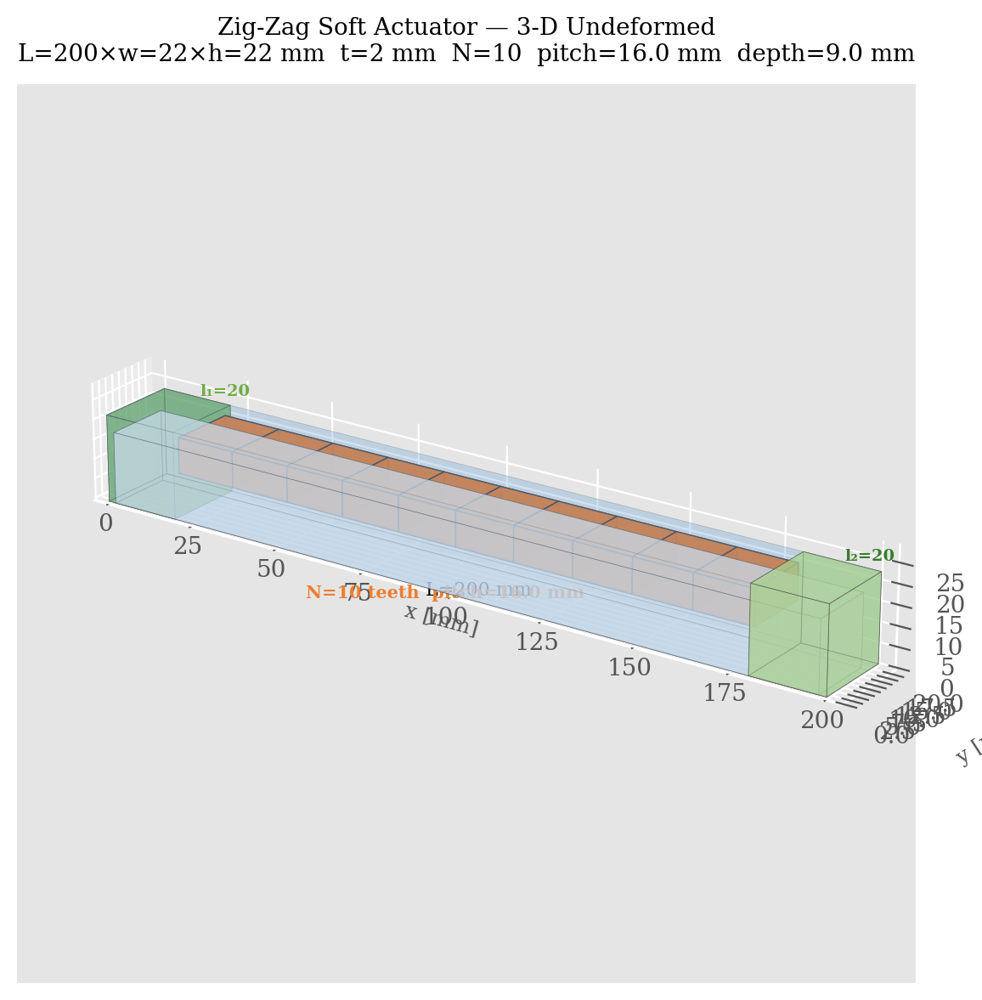
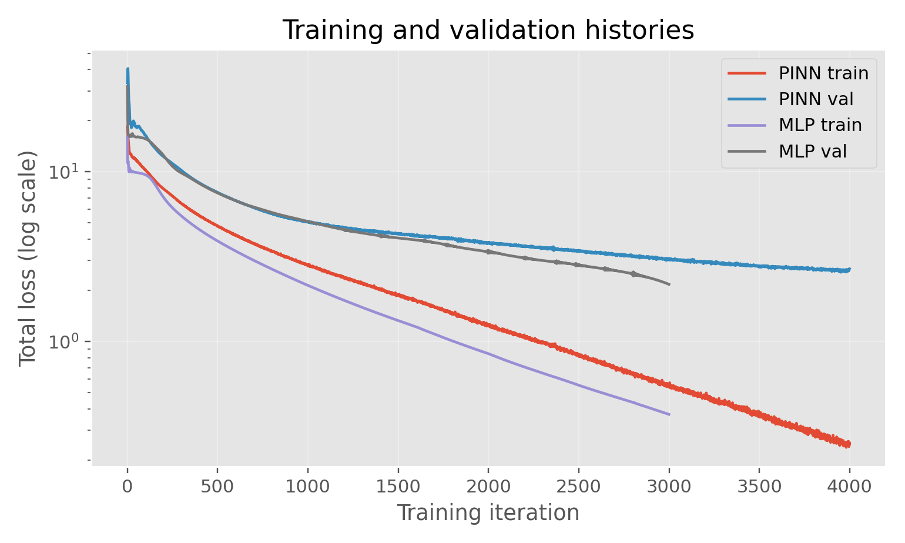

# Physics-Informed Neural Network for Inverse Parameter Identification of a Pneumatic Zig-Zag Soft Bending Actuator

A reduced-order inverse modeling framework that identifies effective mechanical parameters of a pneumatic zig-zag soft bending actuator from sparse displacement and force observations, using a Physics-Informed Neural Network (PINN).

---

## Research Question

> **Can a PINN simultaneously learn the actuator's deformed centerline field and identify its effective bending stiffness $EI_\text{eff}$ and pressure-to-actuation coefficient $k_p$ from sparse tip-displacement and blocked-force data, while enforcing the continuum mechanics governing equations?**

This project frames actuator calibration as an **inverse mechanics problem** rather than a black-box regression task. The PINN embeds the reduced-order beam model directly into the loss function, enabling physics-consistent parameter identification without repeated FEM simulations. A pure data-driven MLP baseline is trained and compared on the same data.

---

## Mathematical Model

The actuator centerline is modeled as an inextensible Euler–Bernoulli beam parameterized by arc length $s \in [0, L]$.

**Kinematics:**
$$\frac{dx}{ds} = \cos\theta(s), \qquad \frac{dy}{ds} = \sin\theta(s)$$

**Moment balance (reduced-order):**
$$EI_\text{eff}\,\theta''(s) + k_p\, p = 0$$

**Boundary conditions (clamped-free):**
$$\theta(0)=0,\quad x(0)=0,\quad y(0)=0,\quad \theta'(L)=0$$

The two unknowns $EI_\text{eff}$ and $k_p$ are treated as **trainable parameters** inside the PINN. The PINN total loss combines:

$$\mathcal{L} = \underbrace{\mathcal{L}_\text{phys}}_{\text{PDE residual}} + \underbrace{\mathcal{L}_\text{BC}}_{\text{boundary cond.}} + \underbrace{\mathcal{L}_\text{shape}}_{\text{centerline obs.}} + \underbrace{\mathcal{L}_\text{tip}}_{\text{tip disp. \ angle}} + \underbrace{\mathcal{L}_\text{block}}_{\text{blocked force}}$$

**Blocked force** is defined as the tip reaction force required to hold $y(L)=0$ under pressure loading — the physically meaningful definition for soft gripper design. It is computed via a constrained BVP solver and used as a supervised observation.

**Analytical baseline solution** (for uniform actuation moment, small deformation):
$$\theta(s) = \frac{k_p\, p}{EI_\text{eff}}\left(Ls - \frac{s^2}{2}\right), \qquad y(L) \approx \frac{k_p\, p\, L^3}{3\,EI_\text{eff}}, \qquad F_b \approx k_p\, p$$

---

## Actuator Geometry

| Parameter | Value |
|-----------|-------|
| Total length $L$ | 150 mm |
| Cross-section $w \times h$ | 22 × 22 mm |
| Wall thickness $t$ | 2 mm |
| Inlet plain region $l_1$ | 20 mm |
| Free-tip plain region $l_2$ | 20 mm |
| Active zig-zag region | 110 mm |
| Number of teeth $N$ | 10 |
| Tooth pitch | 11 mm |
| Tooth depth | 9 mm |
| Compliance factor | 0.85 |

### 2-D Side View


*Annotated side-view diagram showing all geometric dimensions, the zig-zag tooth profile, inlet/free-tip plain regions, and pressure inlet direction.*

### 3-D Undeformed Geometry



*Transparent 3-D render of the undeformed actuator body. Orange blocks are the zig-zag teeth protruding into the internal cavity; green blocks are the plain inlet and free-tip end regions.*

### 3-D Deformed Shapes


*Cross-section extruded along the analytically computed centerline at four pressure levels (10, 40, 69, 100 kPa). At 100 kPa the tip angle exceeds 100°, entering a large-deformation regime where the reduced-order model begins to break down.*

### Geometry Summary


*Six-panel summary: cross-section, tooth profile, tip response vs pressure, axial layout, centerline family, and parameter table.*

---

## Running the Code

```bash
pip install -r requirements.txt

# 1. Generate synthetic dataset
python src/data_generation.py

# 2. Train PINN
python src/train_pinn.py

# 3. Train baseline MLP
python src/train_mlp.py

# 4. Evaluate and generate all result figures
python src/evaluate.py

# 5. Run ablation experiments
python src/experiments.py --exp 1          # Exp 1: blocked-force loss ablation
python src/experiments.py --exp 2          # Exp 2: data-regime comparison
python src/experiments.py --exp all        # Both experiments
```

---

## Results

### Training Histories



Both the PINN and MLP converge smoothly. The PINN training loss is higher than the MLP because it also minimizes physics and boundary-condition residuals in addition to fitting the data. Both models reach stable validation loss without overfitting.

---

### PINN Parameter Identification


The PINN simultaneously identifies $EI_\text{eff}$ and $k_p$ during training. Both parameters undergo an initial transient (approximately 0–400 iterations) as the network navigates the loss landscape, then converge toward their final values. The identified $k_p$ reaches the true value closely (error < 1%), while $EI_\text{eff}$ converges to within approximately 20% — a consequence of the EI–kp degeneracy along the tip-displacement manifold (see Experiment 1 for analysis).

---

### Tip Displacement Response


Both the PINN and MLP match the reference well in the low-to-medium pressure range (10–45 kPa). At higher pressures, both models underestimate the tip displacement due to the large-deformation nonlinearity that the reduced-order linear model cannot fully capture. The PINN outperforms the MLP at higher pressures, with tip RMSE of **31.9 mm** vs **39.5 mm**.

---

### Blocked Force


The PINN's linear blocked-force surrogate ($F_b \approx \frac{8}{3} k_p p$) tracks the nonlinear reference closely throughout the full pressure range, with RMSE of **1.63 mN**. This excellent agreement confirms that $k_p$ is identified accurately — blocked force is nearly independent of $EI_\text{eff}$, making it the most informative observation for $k_p$ identification.

---

### Deformed Centerline Comparison


Centerline shapes at 8 pressure levels reveal where each model fits well and where it breaks down. Both PINN and MLP track the reference closely up to approximately **40 kPa** (tip errors < 3 mm). Beyond 55 kPa, errors grow substantially as the actuator enters the large-deformation regime (tip angle > 45°). At 100 kPa the reference centerline curves back past the vertical, a geometric nonlinearity that neither model can reproduce with the current reduced-order formulation. The PINN consistently achieves smaller tip errors than the MLP across all pressure levels.

---

### Complete Results Summary


*Comprehensive 3×4 panel: training losses, physics loss breakdown, parameter convergence, parameter identification bar chart, tip response, tip error, blocked force, three centerline panels, and a metrics summary table.*

---

## Experiment 1 — Effect of Blocked-Force Loss

**Question:** Does the blocked-force observation actually help parameter identification, and which parameter does it constrain?

Two PINN variants are trained on identical data:
- **Version A** — blocked-force loss removed ($w_\text{block} = 0$)
- **Version B** — blocked-force loss included ($w_\text{block} = 10$, original)


**Key findings:**

| Metric | PINN-A (no block loss) | PINN-B (with block loss) |
|--------|----------------------|--------------------------|
| $EI_\text{eff}$ error | 27.83% | 20.19% |
| $k_p$ error | **40.92%** | **0.84%** |
| Tip displacement RMSE | 39.2 mm | 32.0 mm |
| Blocked force RMSE | 79.78 mN | 1.63 mN |

The results confirm the theoretical identifiability analysis: $k_p$ is almost entirely determined by the blocked-force loss (error drops from 41% to 0.84%), while $EI_\text{eff}$ improves more modestly. Without the blocked-force loss, $k_p$ drifts freely because tip displacement alone cannot distinguish between parameter pairs $(EI, k_p)$ and $(\alpha \cdot EI, \alpha \cdot k_p)$ for any scalar $\alpha$ — a fundamental degeneracy of the model along this measurement modality.

---

## Experiment 2 — PINN vs MLP Under Different Data Regimes

**Question:** Is the PINN more data-efficient than the MLP? Does enforcing physics help when data is scarce?

Three data budgets are tested (averaged over 3 random seeds):

| Regime | Training pressure levels |
|--------|--------------------------|
| Low | 3 levels |
| Medium | 6 levels (original) |
| High | 8 levels |


**Key findings:**

- **PINN consistently outperforms MLP** on both tip displacement RMSE and shape RMSE across all data regimes — the gap is largest in the low-data setting.
- In the **low-data regime**, the PINN achieves tip RMSE of 42.4 mm vs MLP's 59.8 mm — a **29% reduction** — demonstrating that physics constraints act as an effective regulariser when observations are scarce.
- **Shape RMSE** shows the same trend: PINN 36.8 mm vs MLP 47.3 mm under low data.
- $EI_\text{eff}$ identification improves with more data (31% → 20% → 23% error), though the non-monotone high-regime result reflects sensitivity to the specific pressure levels sampled and residual EI–kp degeneracy.
- The MLP shows higher variance across seeds under low data, while the PINN variance remains more controlled — consistent with physics-constrained regularisation stabilising training.

---

## Limitations and Discussion

The reduced-order model captures the actuator's behaviour well in the **low-to-moderate pressure range** (10–45 kPa, tip angle ≲ 40°) but breaks down at high pressures for the following reasons:

1. **Large-deformation nonlinearity.** The Euler–Bernoulli model assumes moderately large rotations but neglects higher-order geometric effects. At 100 kPa the tip angle exceeds 100°, well beyond the model's validity range.
2. **Uniform actuation moment approximation.** The shape function $g(s;\mu) = 1$ ignores the spatial variation of the pneumatic actuation caused by the zig-zag chamber geometry. A pressure-dependent or spatially varying $g(s)$ would improve accuracy at high pressures.
3. **EI–kp degeneracy.** Tip displacement alone cannot uniquely identify both parameters simultaneously. Blocked-force observations break this degeneracy for $k_p$, but $EI_\text{eff}$ identification remains sensitive to data coverage.

**Next steps:** FEM-generated or experimental data, spatially varying compliance factor $g(s;\mu)$, and domain-decomposed PINNs (XPINNs) to improve large-deformation accuracy.

---

## File Structure

```
soft_actuator_pinn_starter/
├── data/
│   ├── synthetic/          ← auto-generated CSVs
│   └── fem/                ← placeholder for FEM data
├── results/
│   ├── figures/            ← all output figures
│   ├── exp1/               ← Experiment 1 outputs
│   └── exp2/               ← Experiment 2 outputs
├── report/
├── slides/
├── src/
│   ├── actuator_config.py
│   ├── reduced_model.py
│   ├── data_generation.py
│   ├── pinn_model.py
│   ├── train_pinn.py
│   ├── train_mlp.py
│   ├── evaluate.py
│   ├── visualize_actuator_case.py
│   ├── visualize_zigzag_geometry.py
│   └── experiments.py
├── README.md
└── requirements.txt
```
